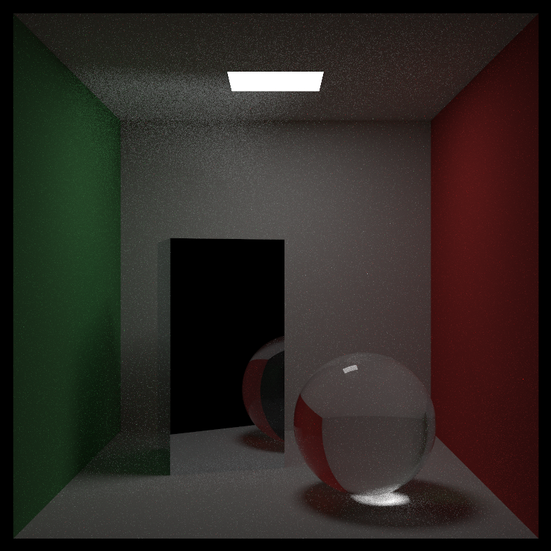
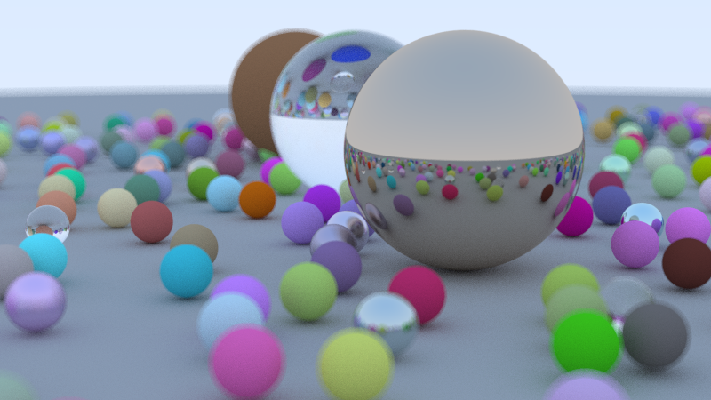

## Path Tracer

usage: `cargo run`

Most Recent Render:  

Demo Render 2:  

Demo Render:  

[_Ray Tracing: In a Weekend_](https://raytracing.github.io/books/RayTracingInOneWeekend.html#outputanimage) \
[_Ray Tracing: The Next Week_](https://raytracing.github.io/books/RayTracingTheNextWeek.html)

